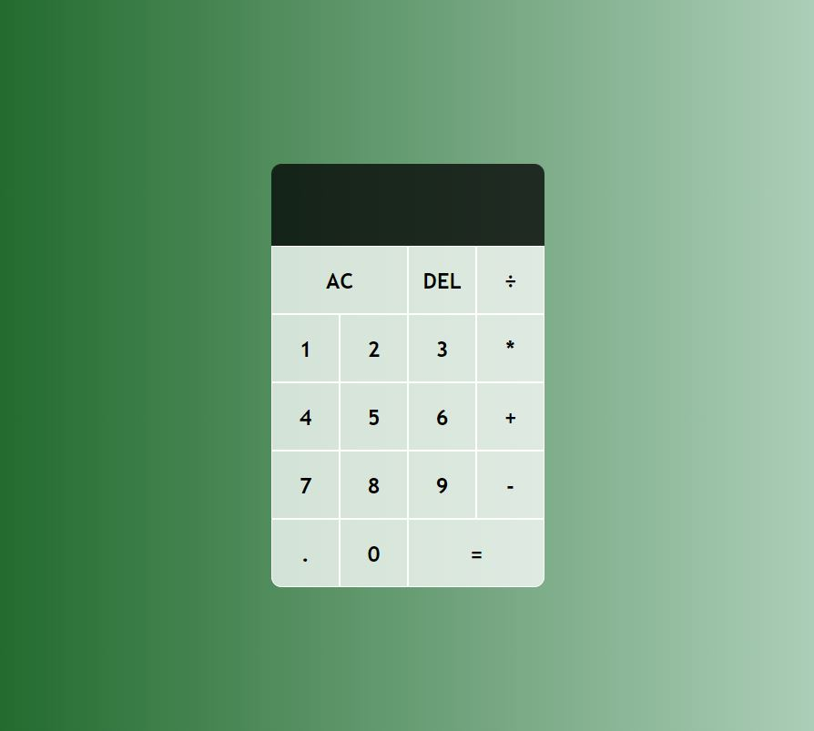

# Personal Project: Calculator Tool

## Introduction

Welcome to the respository for a personal project of mine, in this project, I've followed the below Youtube video and have created a Calculator within the web browser.

[Build A Calculator With JavaScript Tutorial](https://www.youtube.com/watch?v=j59qQ7YWLxw)

### The Why?

    The reason for doing this is to supplement my learning on the EdX Front End Dev bootcamp, and to develop upon my current learnings.

## Technologies Used

* HTML5
* CSS3
* JavaScript

## Project Structure

The project structure is organized as follows:

* **index.html:** The main HTML file containing the structure of the calculator.
* **style.css:** The CSS file for styling the calculator.
* **script.js:** The JavaScript file with the logic for calculator operations.

## Page Demo

## Instructions for use

To use the calculator, please open the deployed page [from this link](https://aaron1490.github.io/calculator-tool/)

## Installation

To code this yourself, feel free to clone the repository onto your local system

## Contact

* [Click here to email me!](mailto:aaronarmstrong1490@gmail.com)
* [Linkedin](https://www.linkedin.com/in/aaron-armstrong-%E8%89%BE%E4%BF%8A%E6%A8%82-80986ba5/)

## Links

* [Link to the code repository](https://github.com/aaron1490/calculator-tool)
* [Link to the deployed page](https://aaron1490.github.io/calculator-tool/)

## Additional Resources

* [MDN Web Docs - JavaScript](https://developer.mozilla.org/en-US/docs/Web/JavaScript)
* [W3Schools - HTML Tutorial](https://www.w3schools.com/html/)
* [CSS-Tricks](https://css-tricks.com/)

## License

MIT License.

## Acknowledgments

I want to take the opportunity to acknowledge the online content that [Web Dev Simplified](https://www.youtube.com/@WebDevSimplified) has put out, they provide plenty of helpful videos relating to the subject of learning front end development.